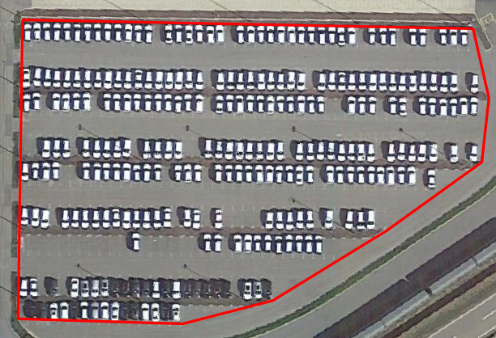
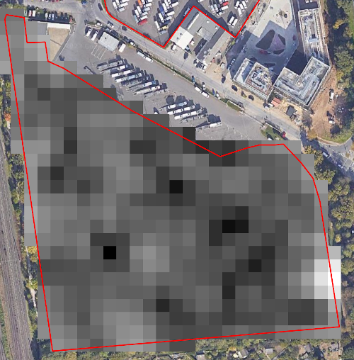
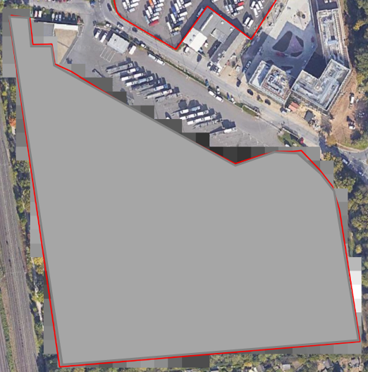
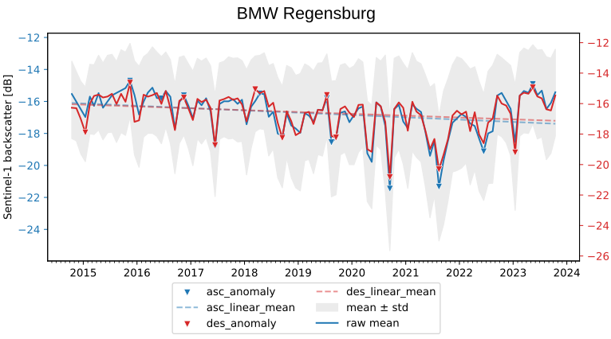

# Sat4Ec

`sat4ec` is a Python package to monitor occupancy rates of German automotive producing sites by exploiting Sentinel-1 IW GRD data.



Cars stored on parking lots of automotive producing facilities interact with the Sentinel-1 SAR wave: their presence or absence returns a strong or weak signal, respectively. The Sat4Ec algorithm aggregates a single mean SAR backscatter value for each AOI and computes a time series. In this way, timestamps of high or low parking lot occupancy rates can be identified.

**Example Output for BMW Regensburg**
 


The following peer-reviewed publication describes the methods and validation process in more detail:
> Kraft, F., Martinis, S., Krullikowski, C., Plank, S., Anghelea, A., Delago Blasco, J. M., Schönenberger, K., Köhlmann, M., & Brauchler, M. (2025). Satellite Data for Economic Insights: Towards Tracking Automotive Production in Germany with Sentinel-1 for Economic Nowcasting. <i>IEEE Journal of Selected Topics in Applied Earth Observations and Remote Sensing</i>, 1–10. https://doi.org/10.1109/JSTARS.2025.3601351

# Quickstart

## Prerequisites

The `sat4ec` indicator requires an active [SentinelHub](https://www.sentinel-hub.com/) subscription or [Copernicus Data Space Ecosystem (CDSE)](https://dataspace.copernicus.eu/) registration.

## Python Module

The main functionality is encapsulated inside the following scripts:

- The algorithm can simply be run from the **Jupyter notebook** `sat4ec.ipynb`. 
- Alternatively, the algorithm can also be executed from the **Python script** `sat4ec/execution/dev/exe_runner.py`.

## CLI

This package also provides standalone CLI functionality:

```
usage: main.py [-h] --aoi_data AOI [--aoi_split {true,false}] --out_dir OUT --start_date YYYY-MM-DD [--end_date YYYY-MM-DD] [--polarization {VH,VV}] [--aggregate {daily,monthly}] [--orbit {asc,des,both}]
               [--name NAME] [--regression {spline,poly,rolling}] [--linear {true,false}] [--linear_fill {true,false}] [--overwrite_raw {true,false}]

Compute aggregated statistics on Sentinel-1 data

options:
  -h, --help            show this help message and exit
  --aoi_data AOI        Path to AOI.[GEOJSON, SHP, GPKG], AOI geometry as WKT, Polygon or Multipolygon.
  --aoi_split {true,false}
                        Wether to split the AOI into separate features or not, default: false.
  --out_dir OUT         Path to output directory.
  --start_date YYYY-MM-DD
                        Begin of the time series, as YYYY-MM-DD, like 2020-11-01
  --end_date YYYY-MM-DD
                        End of the time series, as YYYY-MM-DD, like 2020-11-01
  --polarization {VH,VV}
                        Polarization of Sentinel-1 data, default: VH
  --aggregate {daily,monthly}
                        Aggregation interval, default: daily
  --orbit {asc,des,both}
                        Orbit of Sentinel-1 data, default: ascending
  --name NAME           Name of the location, e.g. BMW Regensburg. Appears in the plot title.
  --regression {spline,poly,rolling}
                        Type of the regression, default: spline.
  --linear {true,false}
                        Wether to plot the linear regression with insensitive range or not, default: false.
  --linear_fill {true,false}
                        Wether to fill the linear insensitive range or not, default: false.
  --overwrite_raw {true,false}
                        Overwrite existing raw data if desired, default: false.
```

# Installation

This project uses a `conda` environment. For installing dependencies use:

```bash
conda env create
```

# Dependencies
For the latest list of dependencies check the [`environment.yml`](environment.yml).

# Development

Some development guardrails are enforced via [`pre-commit`](https://pre-commit.com/). This is to
ensure we follow similar code styles or it automatically cleans up jupyter notebooks.

To install `pre-commit` (not necessary if you [installed the conda
environment](#Installation)):

```shell
conda/pip install pre-commit
```

To initialize all pre-commit hooks, run:

```shell
pre-commit install
```

To test whether `pre-commit` works:

```shell
pre-commit run --all-files
```

It will check all files tracked by git and apply the triggers set up in
[`.pre-commit-config.yaml`](.pre-commit-config.yaml). That is, it will run triggers, possibly
changing the contents of the file (e.g. `black` formatting). Once set up, `pre-commit` will run, as
the name implies, prior to each `git commit`. In its current config, it will format code with
`black` and `isort`, clean up `jupyter notebook` output cells, remove trailing whitespaces and will
block large files to be committed. If it fails, one has to re-stage the affected files (`git add` or
`git stage`), and re-commit.

## Testing

The code applies Python unit tests, located in `tests` with test data in `tests/testdata`.

# Contributors
The Sat4Ec project team includes (in alphabetical order):
* Anghelea, Anca (ESA)
* Delgado Blasco, José Manuel (Ranstad)
* Kraft, Franziska (DLR)
* Krullikowski, Christian (DLR)
* Martinis, Sandro (DLR)
* Plank, Simon (DLR)
* Schönenberger, Klara (Destatis)

European Space Agency (ESA),
German Aerospace Center (DLR),
Randstad Italia SPA (Ranstad),
Federal Statistical Office of Germany (Destatis)

# Licenses
This software is licensed under the [Apache 2.0 License](LICENSE.txt).

Copyright (c) 2024 German Aerospace Center (DLR) * German Remote Sensing Data Center * Department:
Geo-Risks and Civil Security

# Changelog

See [changelog](CHANGELOG.md)

# Contributing

The development team welcomes contributions from the community.  For more detailed information, see our guide on [contributing](CONTRIBUTING.md) if you're interested in getting involved.

# What is Sat4Ec?

The project Sat4Ec is funded by the European Statistical Office (Eurostat). The project aims to estimate the gross domnestic product (GDP) from satellite time series in Germany. The idea observing car occupancy rates and linking those to economic variables was originally developed by ESA and the RHEA Group.
