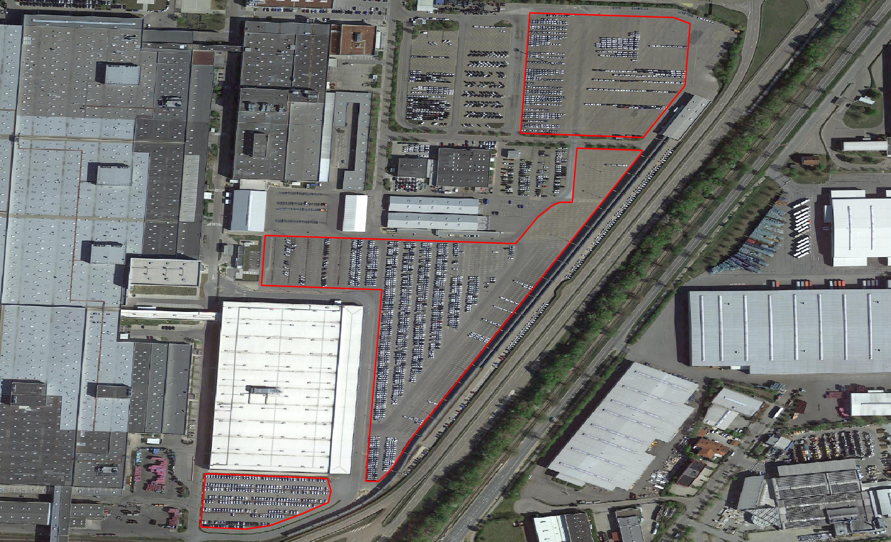
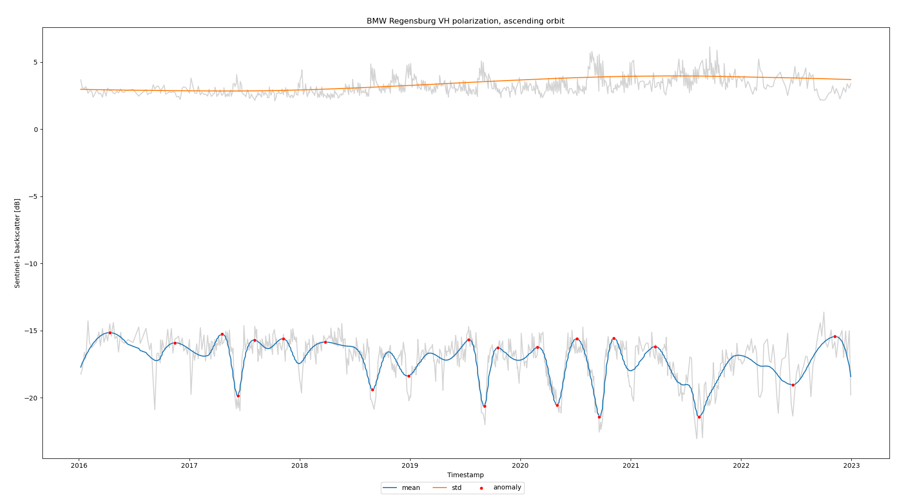

# Sat4Ec

This repository tracks occupation of parking lots of automobile producers with Sentinel-1 data.
Please read the in-depth documentation unter `docs/`.

## Installation

Build the docker image.

```
docker build -f sat4ec.Dockerfile -t sat4ec .
```

## Usage

### Preparation

Define an area of interest (AOI) over a production parking lot and save as geojson or gpkg.



Cars are often parked in very small space and covered with a protective layer.


### Execution

Execute the docker container.

```
docker run
-v /PATH/TO/INPUT/DIR/:/scratch/in/
-v /PATH/TO/OUTDIR/:/scratch/out/
--rm sat4ec
--aoi_data <Path to AOI file or AOI as POLYGON or AOI as WKT>
--start_date <Begin of the time series, as YYYY-MM-DD>
--end_date <End of the time series, as YYYY-MM-DD>
--name <Name of the location, appears as title in the plot, e.g. BMW Regensburg>
--polarization <VH or VV polarization, default is VH>
--orbit <Ascending or descending orbit, announce as asc or des>
--columns <statistical parameters to plot, choose from [mean, std, min, max], default are [mean, std]>
```

`--polarization`, `--orbit` and `--columns` hold default values and do not have to be declared in intetended to use default parameters.

An exemplarily docker call looks like this:

```
docker run
-v /PATH/TO/INPUT/DIR/:/scratch/in/
-v /PATH/TO/OUTDIR/:/scratch/out/
--rm sat4ec
--aoi_data /path/to/aoi.geojson
--start_date 2020-01-01
--end_date 2020-12-31
--name BMW Regensburg
--orbit des
```

## Results

The default settings plot the aggregated mean Sentinel-1 backscatter per AOI with the aggregated standard deviation. All units are in dB. Each datapoint is represented by a distinct date with a 1 day resolution. This data is plotted in grey colors and already shows the timely variation of backscatter. To draw a clearer picture, mean and standard deviation data is interpolated with a weighted spline function. The spline weights were computed with `local_mean / global_mean`, giving datapoints exceeding the global mean a higher significance.



## Data

### Sentinel Hub

Sentinel-1 data downloaded via [Sentinel Hub](https://collections.sentinel-hub.com/sentinel-1-grd/) is the sole source for the statistical analysis. The data is requested as S1 GRD sigma0 and. Custom pre-processing steps include Lee speckle filtering and transformation into decibel [dB] values.

### Google

Sentinel-1 data downloaded via the Google Earth Engine was provided with several [pre-processing steps](https://developers.google.com/earth-engine/guides/sentinel1#sentinel-1-preprocessing). This data is used for raster visualizations alone.

## Development

### Execution
If not intended to run with docker, e.g. for local testing, call and modify the [runner script](tests/sat4ec_runner.py).

### Virtual environment
```
conda create -n sat4ec Python=3.11
conda install matplotlib jupyterlab
conda install gdal fiona shapely geopandas pandas seaborn
conda install sentinelhub
```
