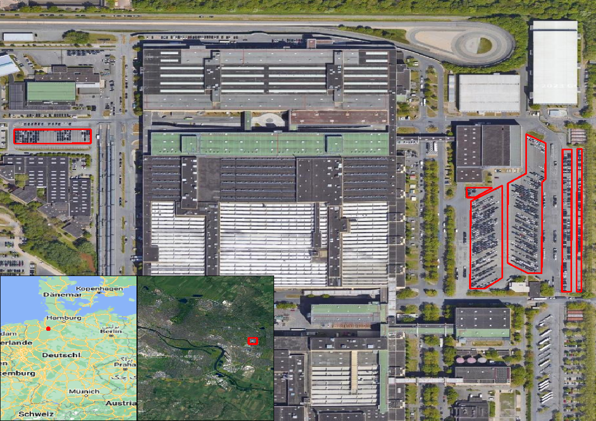

This document provides a description of the areas of interest (AOIs) used in this repository.

### AOI structure

Each AOI covers one or several parking lots at a facility of an automobile producer, e.g. BMW Regensburg. The AOI is a a distinct geographical outline of that parking lot with the intention to observe only produced cars. Therefore, AOIs must be selected with care to not cover parking lots of employees, garages or workshops.

Consider the following AOI over the BMW facility in Regensburg. The AOI consists of three polygons describing the three parking lots. When processing Sentinel-1 data with the `sat4ec` package it is possible to compute either on aggregated AOIs, i.e. handling all polygons as one, or to compute on the sub AOIs in a row, i.e. handling each polygon individually. The latter case does not allow to pick specific sub AOIs. If computing on one facility/AOI but pointing to the sub AOIs individually will compute all of the sub AOIs.


#### Coding AOIs

An AOI, like the AOI over BMW Regensburg, can be saved in one of the following formats: `.geojson`, `.gpkg` or `.shp`. Although supported, it is not recommended working with `.shp` files due to field name limitations and inconvenient file management. 

Considering the `.geojson` format, a decoded AOI (openend in a text browser) looks like the following:

```
{
	"type": "FeatureCollection",
	"name": "test_aoi",
	"crs": {
		"type": "name",
		"properties": {
			"name": "urn:ogc:def:crs:OGC:1.3:CRS84"
		}
	},
	"features": [{
		"type": "Feature",
		"properties": {
			"ID": 1
		},
		"geometry": {
			"type": "Polygon",
			"coordinates": [
				[
					[12.0, 48.1],
					[12.1, 48.1],
					[12.1, 48.0],
					[12.0, 48.0],
					[12.0, 48.1]
				]
			]
		}
	}, {
		"type": "Feature",
		"properties": {
			"ID": 2
		},
		"geometry": {
			"type": "Polygon",
			"coordinates": [
				[
					[12.2, 48.1],
					[12.3, 48.1],
					[12.3, 48.0],
					[12.2, 48.0],
					[12.2, 48.1]
				]
			]
		}
	}]
}
```

This AOI consists of two sub AOIS with the IDs `1` and `2`. Each of the sub AOIs is described as a polygon with geographical coordinates.

### Automobile producers

The following list gives an overview on the producers considers in this package.

| Producer  | Number of facilities |
|-----------|----------------------|
| BMW       | 2                    |
| Audi      | 2                    |
| VW        | 3                    |
| Opel      | 2                    |
| Porsche   | 1                    |
| Ford      | 2                    |
| Mercedes  | 3                    |
| **Total** | **15**               |

### Location of automobile producers

The following list is a collection of automobile producer facilities linking to the dedicated sub sections with further descriptions. Every AOI from the following list is also saved to `sat4ec/docs/aoi_files`.

| Producer | Facility                                        |
|----------|-------------------------------------------------|
| BMW      | [BMW Regensburg](#bmw-regensburg)               |
| BMW      | [BMW Leipzig](#bmw-leipzig)                     |
| Audi     | [Audi Neckars-Ulm](#audi-neckars-ulm)           |
| Audi     | [Audi Ingolstadt](#audi-ingolstadt)             |
| VW       | [VW Wolfsburg](#vw-wolfsburg)                   |
| VW       | [VW Emden](#vw-emden)                           |
| VW       | [VW Zwickau](#vw-zwickau)                       |
| Opel     | [Opel Ruesselsheim](#opel-ruesselsheim)         |
| Opel     | [Opel Eisenach](#opel-eisenach)                 |
| Porsche  | [Porsche Leipzig](#porsche-leipzig)             |
| Ford     | [Ford Cologne](#ford-cologne)                   |
| Ford     | [Ford Saarlouis](#ford-saarlouis)               |
| Mercedes | [Mercedes Bremen](#mercedes-bremen)             |
| Mercedes | [Mercedes Ludwigsfelde](#mercedes-ludwigsfelde) |
| Mercedes | [Mercedes Duesseldorf](#mercedes-duesseldorf)   |


#### BMW Regensburg


#### BMW Leipzig


#### Audi Neckars-Ulm


#### Audi Ingolstadt


#### VW Wolfsburg


#### VW Emden


#### VW Zwickau


#### Opel Ruesselsheim


#### Opel Eisenach


#### Porsche Leipzig


#### Ford Cologne


#### Ford Saarlouis


#### Mercedes Bremen



#### Mercedes Ludwigsfelde


#### Mercedes Duesseldorf


### Unfavourable conditions

Some facilities do not build open parking lots or build both open and covered parking lots. Others do not build wide parking lots. Hence, observing those from space is impossible. The following list contains facilities with unfavorable observation conditions.

| Producer | Facility     | Description                      |
|----------|--------------|----------------------------------|
| BMW      | Munich       | Roofs                            |
| BMW      | Dingolfing   | Roofs                            |
| Mercedes | Sindelfingen | Roofs                            |
| Mercedes | Rastatt      | Roofs                            |
| VW       | Osnabrueck   | Roofs                            |
| VW       | Hannover     | Location of parking lots unclear |
| VW       | Dresden      | Indoor production                |
| Porsche  | Stuttgart    | Too small                        |
| Tesla    | Gruenheide   | Too recent                       |

#### Mercedes Sindelfingen


#### Mercedes Rastatt

